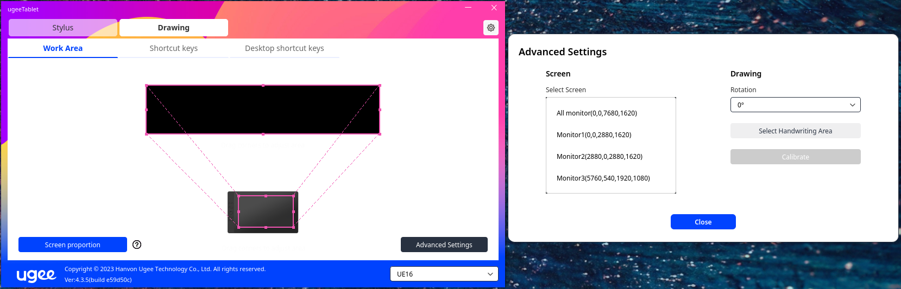

# ugee-tablet-wayland

UGEE tablet driver 4.3.4, patched so it actually works under Wayland.

## The problem

I had purchased the Ugee UE16 tablet, eager to further my artistic ability.

The closed-source `ugeeTabletDriver` from the AUR couldn't see any of my
monitors on Wayland. The driver enumerates displays through XRandR and only
accepts an output whose name sorts after `"Virtual"` (e.g. `"Virtual1"`) or
that exposes an EDID property. Under Wayland/XWayland, outputs are named
things like `DP-1` or `HDMI-A-1` and don't expose EDID at all — so every
monitor got skipped. The result was a driver that mapped everything to `0,0`
on nothing and was basically useless. None of my attempts to draw worked.
This was incredibly frustrating.

I dug into why this was happening and forced it to work properly. With X11
fading out and Wayland becoming the default on more and more distros, this
really should "just work."

## The fix

In `prepare()` the PKGBUILD patches the driver binary at `enum_srceen_info`
(file offset `0x1048d`): the `jle` that pushes outputs down the EDID-only path
is replaced with NOPs, so every active output is enumerated directly. A byte
check beforehand fails the build if the tarball ever changes, because that
might cause problems.

## How the fix was found

The driver finds your screens by asking XRandR for a list of monitors. The
trouble is that monitor names look different depending on your session:

- On X11, the fallback/legacy screen is called something like `Virtual1`.
- On Wayland/XWayland, your real screens are called `DP-1`, `HDMI-A-1`, etc.
depending on how it's connected to the machine, and they don't report an EDID
  identity (the small data block a monitor sends to identify itself).

  So why does X11 have it but XWayland doesn't? EDID comes straight from the
  monitor, and only the program driving your screen can read it. On X11 that's
  the X server, so it gets the EDID and shares it. On Wayland the compositor is
  the one driving the screen and it doesn't share the EDID with XWayland and
  just hands XWayland `DP-1`/`HDMI-A-1` entries instead.

The driver had a faulty rule: *"if the monitor name comes alphabetically before
`Virtual`, only accept it if it has an EDID."* Since `DP-1` and `HDMI-A-1` start
with D and H — which come before V — every Wayland screen fell into that rule
and got thrown out for having no EDID. That's why the list was empty.

The fix reaches into the driver and disables that one rule, so all active
screens are accepted regardless of name or EDID. Technically this means
overwriting a single jump instruction (`jle`) with "do nothing" bytes (NOPs) at
offset `0x1048d` in the `ugeeTabletDriver` binary. The build checks those exact
bytes first, so it'll refuse to patch if UGEE ever changes the driver code to avoid problems.

## Building / installing

After cloning the repo and changing your directory to be inside of it, run this:

```sh
makepkg -si   # downloads the (proprietary) driver from UGEE, patches it, installs
```

Notes:

- Requires an XWayland session; the driver runs under XWayland.
- Conflicts with and provides `ugee-tablet`.
- The driver tarball is proprietary; it is downloaded at build time and never
  committed to this repository.
- If you're not on Wayland, this patch isn't for you — just use `ugee-tablet` from the AUR. If you're on some other non-X11 setup and it isn't working, I'm afraid I don't have an answer for you. Someone will need to make a patch for it and share.
- I can't offer support right now; I don't yet fully understand how all of this works and it took me a while to sort out so I could use my tablet's driver instead of settling for a generic one and missing out on configuring the buttons and pen properly as designed. Figuring out a patch for this one was easier than figuring out how to improve the generic tablet drivers available on Arch, but maybe later down the road? Contributions are very welcome, but for now I can only help by testing on my machine under Wayland.

## How do I know it worked?

After installing, open the `ugeeTabletDriver` UI. Go to the "Drawing" tab, then
"Work Area". It should actually display a work area, and Advanced Settings will
show you screens to select:



If the list is still empty and your Work Area pointing at nothing in the upper-left,
the patch didn't work.
